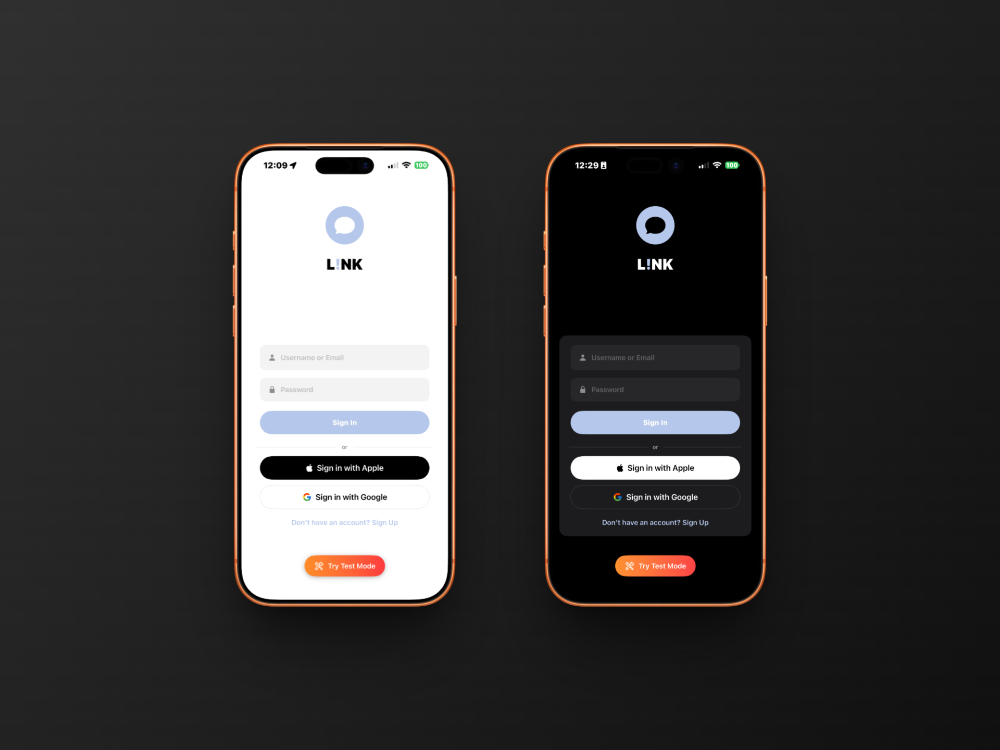
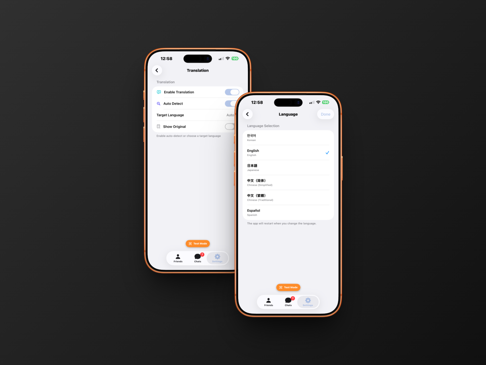
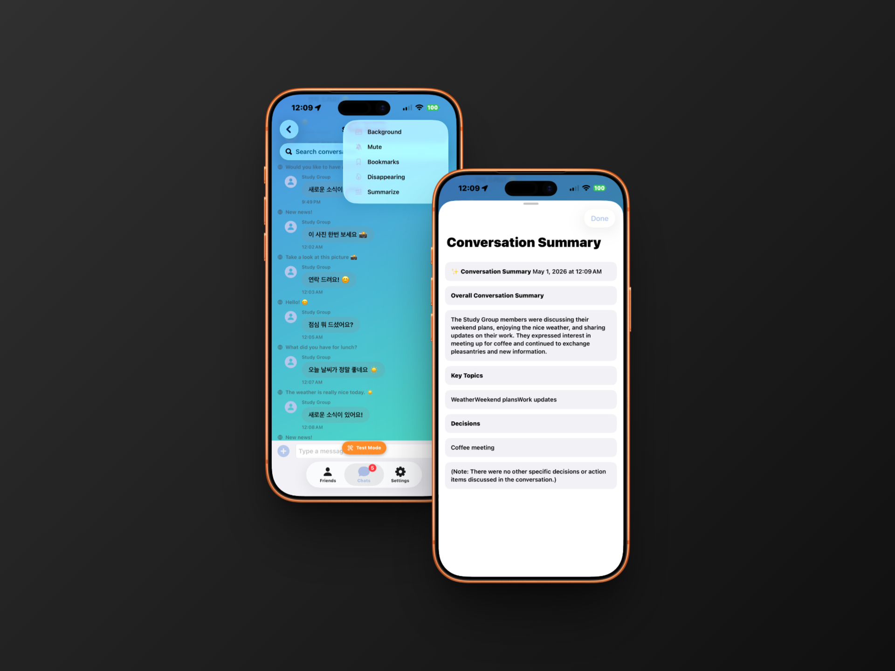
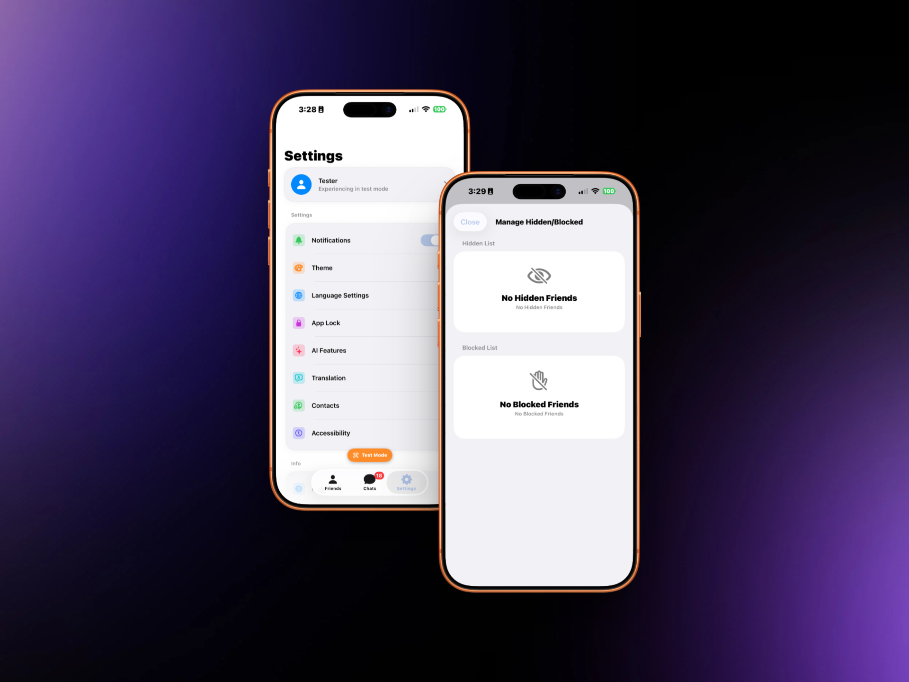
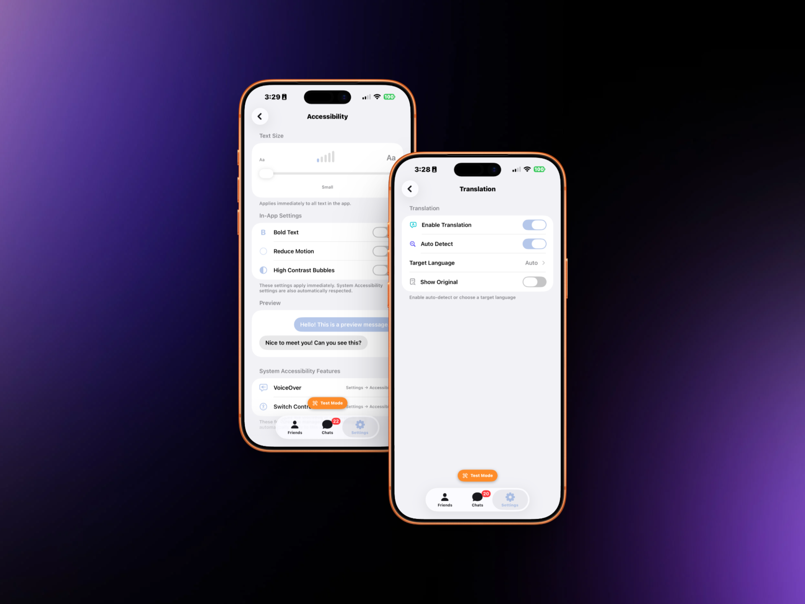

<div align="center">

# L!nk

**Messaging without borders. Minimal by design. Universal by nature.**


<br/>

_A messenger that gets out of your way — and breaks language barriers while it's at it._

<br/>



</div>

---

## The Problem

Modern messengers are exhausting.

Buttons everywhere. Tabs you never use. Reactions, stories, channels, bots, stickers — all fighting for your attention before you've even typed a word.

And if you want to talk to someone who speaks a different language? You're copy-pasting into a translation app and back. Every. Single. Time.

---

## The Solution

**L!nk** strips messaging down to what it actually is: two people talking.

Clean interface. No noise. And one feature that changes everything — **real-time auto-translation**, inline, right below every message.

Write in Korean. They write in Japanese. You both read in your own language.
No copy-paste. No switching apps. No awkward pauses.

Just conversation.

---

## Core Feature — Auto Translation

Turn it on once. Forget it's there.

> Original: Hola! ¿Cómo estás?  
> Translated: 안녕! 잘 지내? 🌐
>
> Original: 저도 잘 지내요! 오늘 뭐 해요?  
> Translated: I'm good too! What are you up to today? 🌐

Every message, automatically translated into your default language — inline, instantly, unobtrusively.

---

## Why "L!nk"

The exclamation mark isn't a typo.

It's the moment of connection — the spark when two people understand each other despite speaking different languages. L!nk is built to create that moment, again and again, for anyone, anywhere.

---

## Features

- **Minimal UI** — only what you need to send a message
- **Auto-translation** — real-time, inline, supports 50+ languages
- **Multi-language app** — Korean, English, Japanese, Chinese, Spanish
- **Voice messages** — hold to record, tap to play, waveform display
- **Link previews** — rich metadata loaded automatically for URLs
- **Read receipts** — checkmark icons showing message delivery and read state
- **AI summary** — on-device conversation summary powered by FoundationModels
- **Reactions & bookmarks** — emoji reactions and bookmarked messages
- **Disappearing messages** — auto-delete after a configurable duration
- **Scheduled send** — queue messages to send at a future time
- **App lock** — Face ID / Touch ID protection
- **Accessibility** — dynamic type, high contrast, screen reader support

---

## Tech Stack

| Layer          | Technology                  |
| -------------- | --------------------------- |
| Language       | Swift 5.9+                  |
| UI Framework   | SwiftUI                     |
| Architecture   | MVVM                        |
| Translation    | Apple Translation Framework |
| Minimum Target | iOS 17+                     |

---

## Screenshots

### Translation



### AI Summary



### Settings



### Accessibility



### Voice Message


---

## Getting Started

### Requirements

- Xcode 15+
- iOS 17+
- Swift 5.9+

---

## Project Structure

```
TalkMVP/
├── App/
│   ├── TalkMVPApp.swift
│   └── ContentView.swift
│
├── Auth/
│   ├── AuthView.swift
│   └── AuthManager.swift
│
├── Chat/
│   ├── ChatView.swift                  # Root view + scaffold
│   ├── ChatView+Input.swift            # Text input bar, voice recording
│   ├── ChatView+Messages.swift         # Message list, translation, search
│   ├── ChatView+Media.swift            # Photo / video / file send
│   ├── ChatView+Friends.swift          # Friend state, notifications toggle
│   ├── ChatView+Helpers.swift          # Bookmark, disappearing, scheduled, summary
│   ├── ChatView+Sheets.swift           # Sheet presentations
│   ├── ChatViewAlertModifiers.swift    # Alert modifier composition
│   ├── ChatViewSupportingViews.swift   # LinkPreviewView, ReactionPicker, etc.
│   ├── ChatViewModel.swift             # MVVM view model
│   ├── ChatListView.swift              # Conversation list
│   ├── MessageBubbleView.swift         # Per-message bubble (text/image/audio/file)
│   ├── ConnectionStatusView.swift      # Online / offline banner
│   ├── TypingIndicatorView.swift       # Animated typing dots
│   ├── ChatRoom.swift                  # ChatRoom SwiftData model
│   └── Message.swift                  # Message SwiftData model
│
├── Friends/
│   ├── FriendsView.swift
│   ├── FriendsListView.swift
│   ├── FriendProfileView.swift
│   ├── FriendManagementViews.swift
│   ├── FriendRowViews.swift
│   ├── FriendSearchService.swift
│   └── AddFriendView.swift
│
├── Settings/
│   ├── SettingsView.swift
│   ├── SettingsView+Security.swift
│   ├── SettingsCardComponents.swift
│   ├── AISettingsView.swift
│   ├── AccessibilitySettingsView.swift
│   ├── AppLockSettingsView.swift
│   ├── AppLockView.swift
│   ├── ChatRoomBackgroundSettings.swift
│   ├── ContactsSettingsView.swift
│   ├── LanguageSettingsView.swift
│   ├── NotificationSettingsView.swift
│   ├── SecuritySettingsView.swift
│   ├── ThemeSettingsView.swift
│   └── TranslationSettingsView.swift
│
├── Services/
│   ├── AIService.swift                 # AI summary (FoundationModels + fallback)
│   ├── AutoResponseService.swift       # Simulated auto-reply logic
│   ├── ChatService.swift               # Real-time message simulation
│   ├── ChatServiceProtocol.swift
│   ├── VoiceMessageService.swift       # AVAudioRecorder / permission
│   ├── ContactsSyncService.swift
│   ├── AttachmentHandler.swift
│   ├── NotificationManager.swift
│   ├── RealtimeChatManager.swift
│   └── LocalizationService.swift
│
├── Repositories/
│   ├── ChatRoomRepository.swift        # ChatRoom SwiftData CRUD
│   └── MessageRepository.swift        # Message SwiftData CRUD
│
├── Managers/
│   ├── AppLockManager.swift
│   ├── LanguageManager.swift
│   ├── LanguageManager+Extensions.swift
│   └── PermissionManager.swift
│
├── Models/
│   ├── User.swift
│   └── (Friendship — embedded in FriendSearchService)
│
├── Profile/
│   ├── ProfileEditView.swift
│   └── OnboardingContactsView.swift
│
├── Help/
│   ├── HelpView.swift
│   ├── AppInfoView.swift
│   └── TermsPoliciesView.swift
│
├── Localization/
│   ├── L10n.swift                      # Localization key enums
│   └── Colors+Extensions.swift         # Color tokens, GlassEffect
│
└── Resources/
    ├── Assets.xcassets
    └── InfoPlist_Additions.plist       # NSMicrophoneUsageDescription, etc.
```

---

## License

Copyright © 2026 David Song. All rights reserved.

This source code is proprietary and confidential. Unauthorized copying, distribution, or use of this software, in whole or in part, is strictly prohibited.

---

---

<div align="center">

# L!nk

**언어의 경계 없이. 미니멀하게 설계된. 모두를 위한 메신저.**


<br/>

_방해받지 않는 메신저 — 그리고 언어 장벽까지 없애줍니다._

<br/>


</div>

---

## 문제

요즘 메신저는 너무 피곤합니다.

버튼이 넘쳐나고, 쓰지도 않는 탭이 가득하고, 리액션, 스토리, 채널, 봇, 스티커 — 메시지 한 줄 보내기도 전에 이미 지칩니다.

다른 언어를 쓰는 사람과 대화하려면? 번역 앱을 왔다 갔다 하며 복사-붙여넣기를 반복해야 합니다. 매번.

---

## 해결책

**L!nk** 는 메시징을 본질로 되돌립니다: 두 사람의 대화.

깔끔한 인터페이스. 불필요한 요소 없음. 그리고 모든 걸 바꾸는 기능 하나 — **실시간 자동 번역**, 메시지 바로 아래에, 인라인으로.

한국어로 쓰세요. 상대방은 일본어로 답합니다. 둘 다 자신의 언어로 읽습니다.
복사-붙여넣기 없음. 앱 전환 없음. 어색한 침묵 없음.

그냥 대화입니다.

---

## 핵심 기능 — 자동 번역

한 번 켜두면, 있다는 것도 잊게 됩니다.

> Original: Hola! ¿Cómo estás?  
> Translated: 안녕! 잘 지내? 🌐
>
> Original: 저도 잘 지내요! 오늘 뭐 해요?  
> Translated: I'm good too! What are you up to today? 🌐

모든 메시지가 자동으로 내 기본 언어로 번역 — 인라인으로, 즉시, 조용하게.

---

## 왜 "L!nk" 인가

느낌표는 오타가 아닙니다.

그것은 연결의 순간 — 서로 다른 언어를 쓰는 두 사람이 서로를 이해하는 그 찰나입니다. L!nk는 그 순간을, 누구에게나, 어디서나, 계속 만들어내기 위해 만들어졌습니다.

---

## 주요 기능

- **미니멀 UI** — 메시지 보내는 데 필요한 것만
- **자동 번역** — 실시간, 인라인, 50개 이상 언어 지원
- **다국어 앱** — 한국어, 영어, 일본어, 중국어, 스페인어 지원
- **음성 메시지** — 꾹 눌러 녹음, 탭하여 재생, 파형 표시
- **링크 미리보기** — URL에 대한 풍부한 메타데이터 자동 로드
- **읽음 확인** — 메시지 전송 및 읽음 상태를 체크마크 아이콘으로 표시
- **AI 요약** — FoundationModels 기반 온디바이스 대화 요약
- **리액션 & 북마크** — 이모지 리액션 및 메시지 북마크
- **자폭 메시지** — 설정한 시간 후 자동 삭제
- **예약 전송** — 원하는 시간에 메시지 예약 발송
- **앱 잠금** — Face ID / Touch ID 보호
- **접근성** — 다이나믹 타입, 고대비, 화면 낭독기 지원

---

## 기술 스택

| 레이어        | 기술                        |
| ------------- | --------------------------- |
| 언어          | Swift 5.9+                  |
| UI 프레임워크 | SwiftUI                     |
| 아키텍처      | MVVM                        |
| 번역          | Apple Translation Framework |
| 최소 타겟     | iOS 17+                     |

---

## 스크린샷

### 번역


### AI 요약


### 설정


### 접근성


### 음성 메시지


---

## 시작하기

### 요구사항

- Xcode 15+
- iOS 17+
- Swift 5.9+

---

## 프로젝트 구조

```
TalkMVP/
├── App/
│   ├── TalkMVPApp.swift
│   └── ContentView.swift
│
├── Auth/
│   ├── AuthView.swift
│   └── AuthManager.swift
│
├── Chat/
│   ├── ChatView.swift                  # 루트 뷰 + 스캐폴드
│   ├── ChatView+Input.swift            # 텍스트 입력바, 음성 녹음
│   ├── ChatView+Messages.swift         # 메시지 목록, 번역, 검색
│   ├── ChatView+Media.swift            # 사진 / 동영상 / 파일 전송
│   ├── ChatView+Friends.swift          # 친구 상태, 알림 토글
│   ├── ChatView+Helpers.swift          # 북마크, 자폭, 예약, AI 요약
│   ├── ChatView+Sheets.swift           # 시트 프레젠테이션
│   ├── ChatViewAlertModifiers.swift    # 알림 모디파이어 조합
│   ├── ChatViewSupportingViews.swift   # LinkPreviewView, ReactionPicker 등
│   ├── ChatViewModel.swift             # MVVM 뷰 모델
│   ├── ChatListView.swift              # 대화 목록
│   ├── MessageBubbleView.swift         # 메시지 버블 (텍스트/이미지/음성/파일)
│   ├── ConnectionStatusView.swift      # 온라인/오프라인 배너
│   ├── TypingIndicatorView.swift       # 입력 중 애니메이션 dots
│   ├── ChatRoom.swift                  # ChatRoom SwiftData 모델
│   └── Message.swift                  # Message SwiftData 모델
│
├── Friends/
│   ├── FriendsView.swift
│   ├── FriendsListView.swift
│   ├── FriendProfileView.swift
│   ├── FriendManagementViews.swift
│   ├── FriendRowViews.swift
│   ├── FriendSearchService.swift
│   └── AddFriendView.swift
│
├── Settings/
│   ├── SettingsView.swift
│   ├── SettingsView+Security.swift
│   ├── SettingsCardComponents.swift
│   ├── AISettingsView.swift
│   ├── AccessibilitySettingsView.swift
│   ├── AppLockSettingsView.swift
│   ├── AppLockView.swift
│   ├── ChatRoomBackgroundSettings.swift
│   ├── ContactsSettingsView.swift
│   ├── LanguageSettingsView.swift
│   ├── NotificationSettingsView.swift
│   ├── SecuritySettingsView.swift
│   ├── ThemeSettingsView.swift
│   └── TranslationSettingsView.swift
│
├── Services/
│   ├── AIService.swift                 # AI 요약 (FoundationModels + 폴백)
│   ├── AutoResponseService.swift       # 자동 응답 시뮬레이션
│   ├── ChatService.swift               # 실시간 메시지 시뮬레이션
│   ├── ChatServiceProtocol.swift
│   ├── VoiceMessageService.swift       # AVAudioRecorder / 권한
│   ├── ContactsSyncService.swift
│   ├── AttachmentHandler.swift
│   ├── NotificationManager.swift
│   ├── RealtimeChatManager.swift
│   └── LocalizationService.swift
│
├── Repositories/
│   ├── ChatRoomRepository.swift        # ChatRoom SwiftData CRUD
│   └── MessageRepository.swift        # Message SwiftData CRUD
│
├── Managers/
│   ├── AppLockManager.swift
│   ├── LanguageManager.swift
│   ├── LanguageManager+Extensions.swift
│   └── PermissionManager.swift
│
├── Models/
│   └── User.swift
│
├── Profile/
│   ├── ProfileEditView.swift
│   └── OnboardingContactsView.swift
│
├── Help/
│   ├── HelpView.swift
│   ├── AppInfoView.swift
│   └── TermsPoliciesView.swift
│
├── Localization/
│   ├── L10n.swift                      # 로컬라이즈 키 열거형
│   └── Colors+Extensions.swift         # 컬러 토큰, GlassEffect
│
└── Resources/
    ├── Assets.xcassets
    └── InfoPlist_Additions.plist       # NSMicrophoneUsageDescription 등
```

---

## 라이선스

Copyright © 2026 David Song. All rights reserved.

이 소스 코드는 독점 소유물이며 기밀입니다. 전체 또는 일부를 무단으로 복사, 배포, 사용하는 것을 엄격히 금지합니다.
